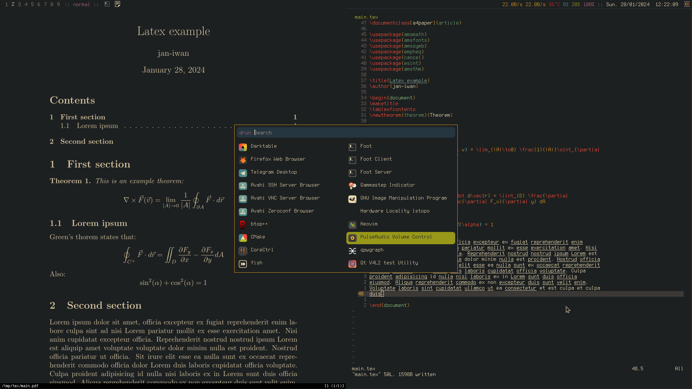
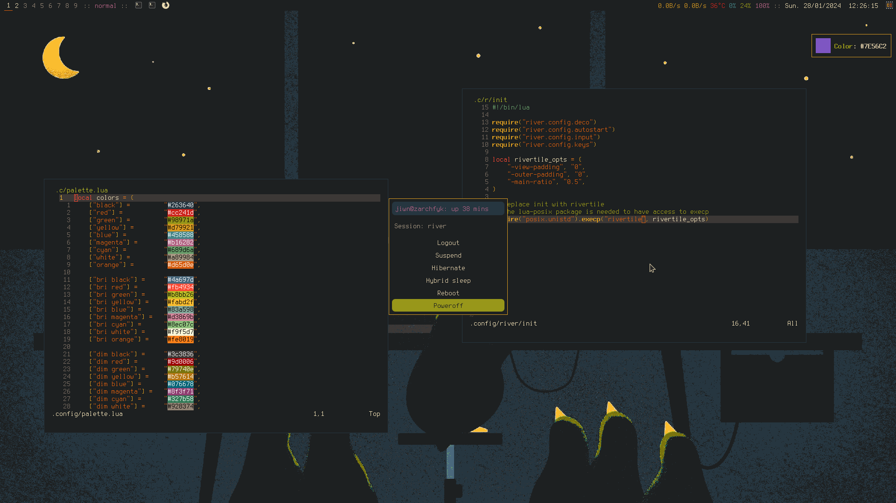
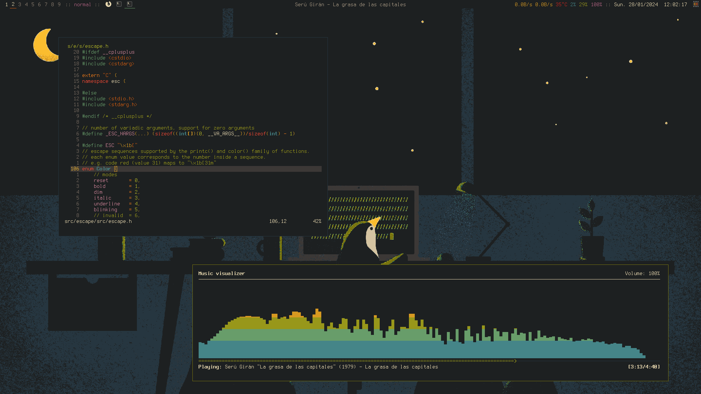

# Dots
## Dotfiles for my Arch Linux desktop

**WM:** river (lua config)

**Shell:** fish

**Terminal:** foot

**Editor:** neovim

**Coloscheme:** Gruvbox

**Font:** Terminus

**Theme:** Klaus

**Icons:** gruvbox-plus-icon-pack

